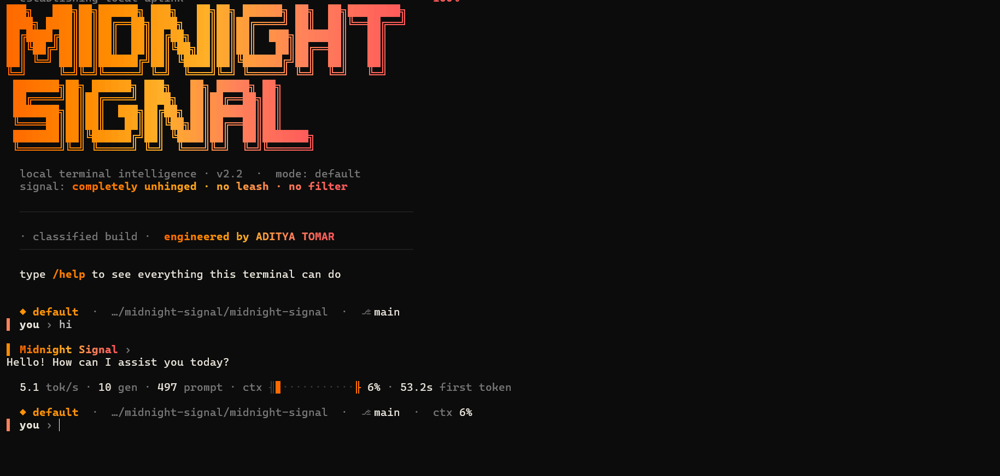
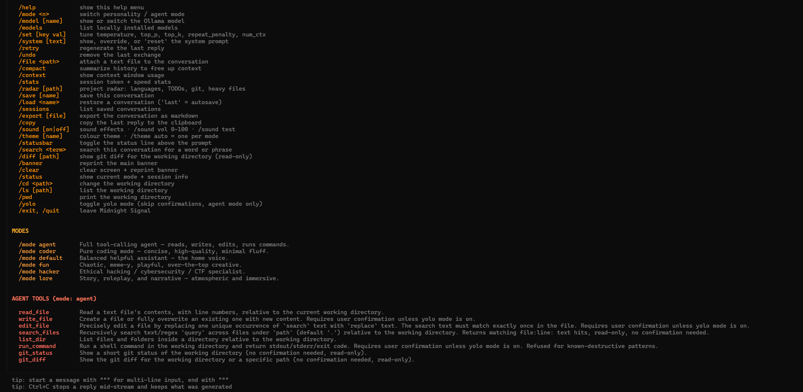

<div align="center">

# 🌒 Midnight Signal

**A cinematic, local terminal AI — built on Ollama.**

True word-by-word streaming, a live truecolor gradient UI with switchable
themes, synthesized sound effects, persistent sessions, a project
**radar** scanner, live model/sampling controls, and a real tool-calling
**agent mode** that reads, writes, edits files, runs shell commands, and
inspects git — with confirmation prompts and an optional "yolo" mode.

[](#)
[](#)
[](#)
[](#)

</div>

---

Uncensored by design: it's built on an abliterated base model and its
system prompts carry no added refusal language or safety lecturing on top
of it — you get the model's own behavior, not a wrapper's opinion of it.

**Base model:** `huihui_ai/qwen2.5-coder-abliterate:7b`

## Screenshots

<p align="center">
  
</p>

<p align="center">
  <em>Boot banner, live gradient UI, and per-reply usage line — v2.2, mode: default</em>
</p>

<p align="center">
  
</p>

<p align="center">
  <em><code>/help</code> — full command list, modes, and agent tools</em>
</p>

---

## Contents

1. [Quick install](#1-quick-install)
2. [Manual install](#2-manual-install)
3. [Run it](#3-run-it)
4. [Commands](#4-commands)
5. [Modes](#5-modes)
6. [Agent mode — how it works](#6-agent-mode--how-it-works)
7. [Adding new modes](#7-adding-new-modes)
8. [Usage bars, sparklines, sound, and themes](#8-usage-bars-sparklines-sound-and-themes)
9. [File overview](#9-file-overview)
10. [Troubleshooting](#10-troubleshooting)

---

## 1. Quick install

The installer checks Python and Ollama, creates a virtual environment,
downloads the base model, builds `midnight-signal` from the `Modelfile`,
and runs a health check — all in one go.

**macOS / Linux**
```bash
git clone https://github.com/<your-username>/midnight-signal.git
cd midnight-signal
./scripts/install.sh
./run.sh
```

**Windows (PowerShell)**
```powershell
git clone https://github.com/<your-username>/midnight-signal.git
cd midnight-signal
powershell -ExecutionPolicy Bypass -File scripts\install.ps1
.\run.ps1
```

Something not working? Run the doctor:

```bash
python midnight_signal.py --doctor
```

It checks Python, the `ollama` package, the Ollama server, both models,
tool-calling support, truecolor, and audio output — and prints the exact
command to fix whatever's missing.

## 2. Manual install

If you'd rather do it by hand, or the installer script doesn't fit your
setup:

```bash
# 1. Ollama running, base model pulled
ollama pull huihui_ai/qwen2.5-coder-abliterate:7b

# 2. Python environment
cd midnight-signal
python3 -m venv .venv
source .venv/bin/activate        # Windows: .venv\Scripts\activate
pip install -r requirements.txt

# 3. Build the custom model
ollama create midnight-signal -f Modelfile
ollama list                      # confirm "midnight-signal" is there

# 4. Run it
python midnight_signal.py
```

Your model must support **tool calling** for `agent` mode to work (recent
Qwen2.5-coder builds do); `--doctor` tells you either way. The other five
modes work with any chat model.

## 3. Run it

```bash
python midnight_signal.py            # fresh session
python midnight_signal.py --resume   # continue the autosaved session
python midnight_signal.py --doctor   # check the install, print fixes
python midnight_signal.py --no-sound # start muted, this run only
python midnight_signal.py --version
```

You'll get a boot sequence, a gradient banner, and a prompt:

```
▌ you ›
```

Type normally to chat — replies stream in word by word, exactly like
`ollama run`. Use `/` commands to control the terminal.

## 4. Commands

Replies stream **word by word**, printed the instant each one arrives —
the same feel as `ollama run`, not a dump of the whole reply at once.
Markdown (headings, bullets, **bold**, *italic*, `code`, fenced code
blocks, tables) is styled live as it streams. Press **Ctrl+C** mid-reply
to stop generation and keep what was produced. Start a message with
`"""` for multi-line input and finish it with `"""`. Up-arrow history and
Tab completion for `/commands` are built in (persisted across runs).

After every reply you get one quiet usage line:

```
38.2 tok/s · 142 gen · 1.8k prompt · ctx ━━────────  23% · 0.4s first token
```

(speed · tokens generated · prompt tokens · context-window fill · time to
first token). The `ctx` figure turns amber past 60% and red past 85%.
`/context` shows the full bar plus a system / conversation / free breakdown.

| Command           | What it does                                              |
|-------------------|------------------------------------------------------------|
| `/help`           | Full gradient help menu — commands, modes, agent tools     |
| `/mode <name>`    | Switch mode, with a cinematic "signal lock" animation      |
| `/model [name]`   | Show or switch the Ollama model live                       |
| `/models`         | List locally installed models                              |
| `/set [key val]`  | Tune `temperature`, `top_p`, `top_k`, `repeat_penalty`, `num_ctx` |
| `/system [text]`  | Show, override, or `reset` the system prompt               |
| `/retry`          | Regenerate the last reply                                  |
| `/undo`           | Remove the last exchange                                   |
| `/file <path>`    | Attach a text file (up to 80KB) to the conversation        |
| `/compact`        | Summarize the history with the model to free up context    |
| `/context`        | Context-window usage bar                                   |
| `/stats`          | Session totals: turns, tokens generated, average speed    |
| `/radar [path]`   | Project radar: languages, heavy files, recent edits, TODO/FIXME markers, git state |
| `/save [name]`    | Save the conversation                                      |
| `/load <name>`    | Restore a conversation (`last` = the autosave)             |
| `/sessions`       | List saved conversations                                   |
| `/export [file]`  | Export the conversation as markdown                        |
| `/copy`           | Copy the last reply to the clipboard                       |
| `/sound [on\|off]` | Toggle sound effects · `/sound vol 0-100` · `/sound test`  |
| `/theme [name]`   | Colour theme · `/theme auto` gives each mode its own        |
| `/statusbar`      | Toggle the status line (mode · dir · git branch · ctx) above the prompt |
| `/search <term>`  | Search this conversation for a word or phrase              |
| `/diff [path]`    | Show `git diff` for the working directory (read-only)      |
| `/banner`         | Reprint the main banner                                    |
| `/clear`          | Clear the screen and reprint the banner                    |
| `/status`         | Mode, model, working directory, yolo state, uptime         |
| `/cd <path>`      | Change the working directory used by agent mode and `/radar` |
| `/ls [path]`      | List the working directory (or a subpath)                  |
| `/pwd`            | Print the current working directory                        |
| `/yolo`           | Toggle yolo mode — skips confirmations in agent mode       |
| `/exit`, `/quit`  | Elegant goodbye and exit                                   |

Sessions live in `~/.midnight_signal/sessions/` as plain JSON, and the
conversation is autosaved to `last` after every reply.

## 5. Modes

| Mode      | Command          | Personality / purpose                                   |
|-----------|------------------|-----------------------------------------------------------|
| Default   | `/mode default`  | Balanced, calm, quietly sharp — the home voice             |
| Hacker    | `/mode hacker`   | Ethical hacking / CTF / cybersecurity, precise, terse       |
| Fun       | `/mode fun`      | Chaotic, meme-y, playful, over-the-top                      |
| Coder     | `/mode coder`    | Pure coding — concise, correct, minimal fluff               |
| Lore      | `/mode lore`     | Story / roleplay / narrative, atmospheric                   |
| Agent     | `/mode agent`    | Full tool-calling agent (see below)                          |

Switching modes resets the conversation and loads a fresh system prompt
from `system_prompts/<mode>.txt`.

## 6. Agent mode — how it works

`agent` mode gives the model real tools, driven by a multi-step
read → reason → act → verify loop (`agent.py`):

- **read_file(path)** — read a file with line numbers
- **write_file(path, content)** — create or fully overwrite a file
- **edit_file(path, search, replace)** — precise, unique search & replace
  (refuses if `search` isn't found exactly once, so it never guesses)
- **list_dir(path)** — list a directory
- **run_command(command)** — run a shell command in the working directory,
  30s timeout, refuses a short list of known-destructive patterns
  (`rm -rf /`, disk-format commands, fork bombs, etc.)
- **git_status()** / **git_diff(path)** — read-only git inspection

Every `write_file`, `edit_file`, and `run_command` call shows you exactly
what it's about to do (a diff for edits, the full command for shell calls)
and asks **[y/N]** before proceeding — unless you've toggled **yolo mode**
with `/yolo`, in which case it proceeds automatically. If you answer **n**,
the model is told you declined and not to retry; if it tries the exact same
action again anyway, the turn stops instead of asking you a second time.
Read-only tools (`read_file`, `list_dir`, `git_status`, `git_diff`) never ask.

Use `/cd` to point the agent at the project directory you want it working
in before you start; all tool paths are resolved relative to it and
sandboxed — the agent can't write outside that directory tree.

The loop stops automatically after 8 tool-call steps per turn as a safety
backstop; if it hits that limit mid-task, just tell it to continue.

Agent-mode replies aren't streamed (the model may need to emit a tool call
instead of text, so there's nothing to show word-by-word until the model
is done deciding) — the final answer prints all at once, same as before.

## 7. Adding new modes

No code changes needed:

1. Create `system_prompts/<your_mode>.txt` with the personality/system prompt.
2. (Optional) add a description to `MODE_DESCRIPTIONS` in
   `midnight_signal.py` for a nicer `/help` line — otherwise it still works
   with a generic description.
3. Run `/mode <your_mode>` — it's auto-discovered from the folder.

Note: only give a mode agent-style tool access by naming it exactly
`agent` (that's the mode `midnight_signal.py` routes through the tool
loop) or by editing `midnight_signal.py`'s routing if you want a second
tool-enabled mode.

## 8. Usage bars, sparklines, sound, and themes

Every token/context display uses a fuel-gauge-style bar with eighth-block
precision (`▏▎▍▌▋▊▉█`) instead of a coarse one-block-per-cell bar, so it
fills smoothly rather than in visible steps, with a bright leading edge
and soft bracket caps (`╢…╟`). You'll see it in the footer under every
reply and in `/context`, which also breaks total usage down into a
stacked bar — system prompt, conversation, and free space, each their own
shade:

```
CONTEXT WINDOW   52%
╢█████████████████████████·······················╟
■ system 1,720    ■ conversation 2,580    ■ free 3,892
```

`/stats` adds a **speed sparkline** — a one-line bar-height history of
your last ~40 replies' tokens/sec, so you can see a session's speed trend
at a glance instead of just the running average.

Every sound is synthesized on the fly (sine/bell/square tones with an
envelope) and cached as tiny WAVs under `~/.midnight_signal/sounds` — no
audio files ship with the project. Playback uses whatever's already on
your system (macOS: `afplay`; Windows: built-in `winsound`; Linux:
`paplay`/`pw-play`/`aplay`/`sox`/`ffplay`, whichever is found first). With
none of those installed, only the important moments fall back to a plain
terminal bell.

| Event | Sound |
|---|---|
| Startup | rising arpeggio into a bell |
| Mode or theme switch | fast downward sweep → click → locked-on ping |
| First token of a reply | a soft blip |
| Agent calls a tool | two quick rising ticks |
| Confirmation waiting for you | a two-note question |
| You approve / decline | bright upward blip / soft downward step |
| Something fails | a low buzzy thud |
| A long reply or task finishes | a glassy two-bell chime |
| Context nearly full, etc. | a gentle heads-up bell |
| Exit | a long falling sweep |

- `/sound` — show sound status
- `/sound on` / `/sound off` — toggle (saved for next launch)
- `/sound vol 0-100` — set volume (saved)
- `/sound test` — play every sound in order, with a label for each
- `python midnight_signal.py --no-sound` — start muted for just this run

Six built-in **themes** repaint every gradient in the UI at once —
banners, bars, the prompt, spinners, the footer:

| Theme | Feel |
|---|---|
| `sunset` | orange → amber → coral → red (the default) |
| `ember` | deep red-orange, warmer and darker |
| `cyber` | magenta → violet → blue → cyan |
| `matrix` | green, terminal-classic |
| `ice` | blue → cyan → white, cool |
| `noir` | white → grey, no color at all |

- `/theme` — list all themes with a live swatch of each
- `/theme <name>` — pin a theme (saved for next launch)
- `/theme auto` — release the pin: each mode wears its own theme
  automatically (`hacker` → matrix, `fun` → cyber, `coder` → ice, `lore` →
  ember, `default`/`agent` → sunset)

## 9. File overview

```
midnight-signal/
├── Modelfile                  # Ollama model definition (base + fallback SYSTEM)
├── requirements.txt
├── run.sh, run.ps1            # launchers (use the .venv if the installer made one)
├── scripts/
│   ├── install.sh             # macOS/Linux one-shot installer
│   └── install.ps1            # Windows one-shot installer
├── system_prompts/
│   ├── default.txt
│   ├── hacker.txt
│   ├── fun.txt
│   ├── coder.txt
│   ├── lore.txt
│   └── agent.txt
├── ui.py                      # gradients, themes, animations, banners, word-by-word stream painter
├── sounds.py                  # synthesized sound effects (no audio files, no pip deps)
├── doctor.py                  # `--doctor` install/health checker
├── session.py                 # save / load / export conversations + settings
├── radar.py                   # /radar project scanner
├── security.py                # keeps replies from leaking the system prompt / tool schema
├── tools.py                   # agent tool implementations + JSON schemas
├── agent.py                   # multi-step tool-calling agent loop
├── midnight_signal.py         # CLI entry point — ties everything together
├── CHANGELOG.md
└── README.md
```

## 10. Troubleshooting

- **`[signal error]` on every message** — the model probably isn't built.
  Run `ollama create midnight-signal -f Modelfile` again and confirm with
  `ollama list`.
- **Agent mode never calls tools / errors about tools** — your Ollama
  version or the base model build doesn't support tool calling. Update
  Ollama and re-pull the base model, or check `--doctor`.
- **Colors look wrong / raw escape codes show up** — your terminal doesn't
  support 24-bit truecolor. Modern terminals (iTerm2, Windows Terminal,
  GNOME Terminal, Alacritty, kitty) do; legacy `cmd.exe` may not.
- **`edit_file` keeps refusing** — its `search` text must match the file
  exactly once. Include a bit more surrounding context in the search text
  to make it unique, or ask the agent to `read_file` first.
- **Slow first response** — normal; Ollama loads the model into memory on
  first use.
- **No sound, or only a terminal beep** — run `python midnight_signal.py
  --doctor` to see which audio player it found (or didn't). On Linux,
  install one of `pulseaudio-utils`, `alsa-utils`, `sox`, or `ffmpeg`.
- **A message that ends in a single unmatched `*` with nothing after it**
  can render as if that character vanished, instead of showing it
  literally — a streaming can't-know-yet edge case at the very end of a
  reply. Cosmetic only; it doesn't affect anything else on the line.

---

Built for a private, local, no-cloud-required terminal AI experience.
